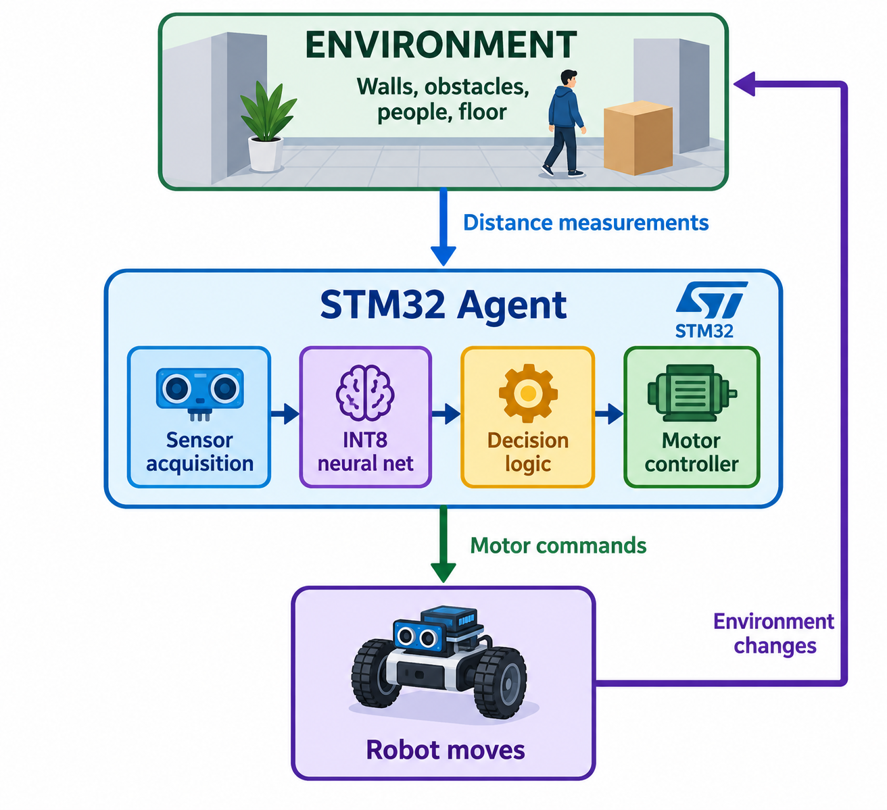

For example, The robot moves forward → approaches a wall → the distance sensor measures a smaller distance → the robot must change its action.

## Agent ##
The agent is the complete autonomous robot:

Agent 
STM32 + RTOS + Sensors + AI + Motor Control 
sensor task $\rightarrow$ AI inference task $\rightarrow$ decision task $\rightarrow$ motor control 
 
The RTOS coordinates these tasks, while the AI model helps determine the robot's action.
Suppose the robot has three distance sensors: 

left=80cm, front=25cm, right=100cm  
    ${x=[0.8, 0.25, 1.0]^T}$

The values are normalized before being given to the neural network.

The model might produce:${y=[-0.65,0.2]^T}$
Where:

- Steering = −0.65: Turn left
- Speed = 0.20: Move slowly 
The robot then converts these outputs into motor commands.
The model does not directly control the motors. It produces a decision that the control software interprets. 

## The complete interaction loop ##

